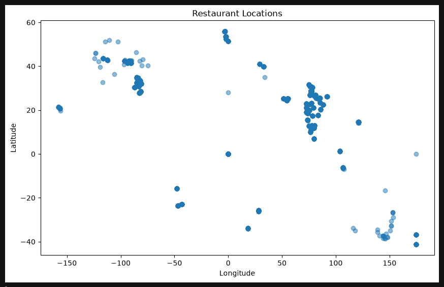
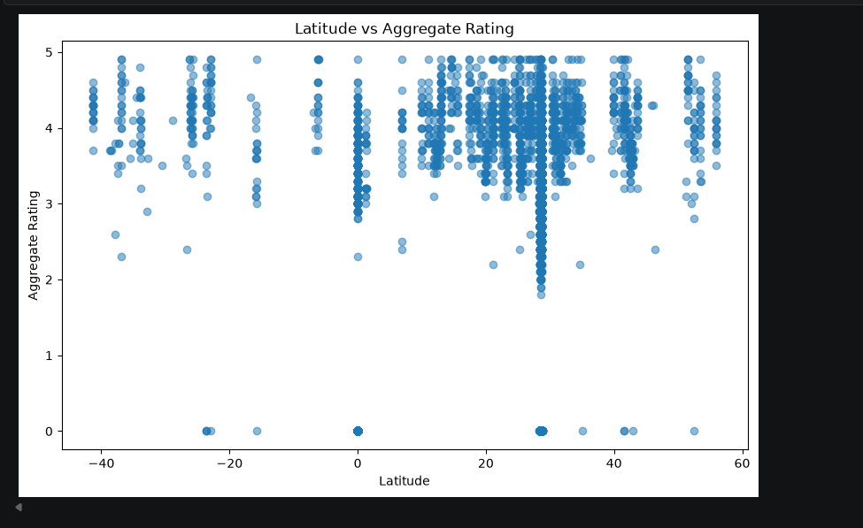
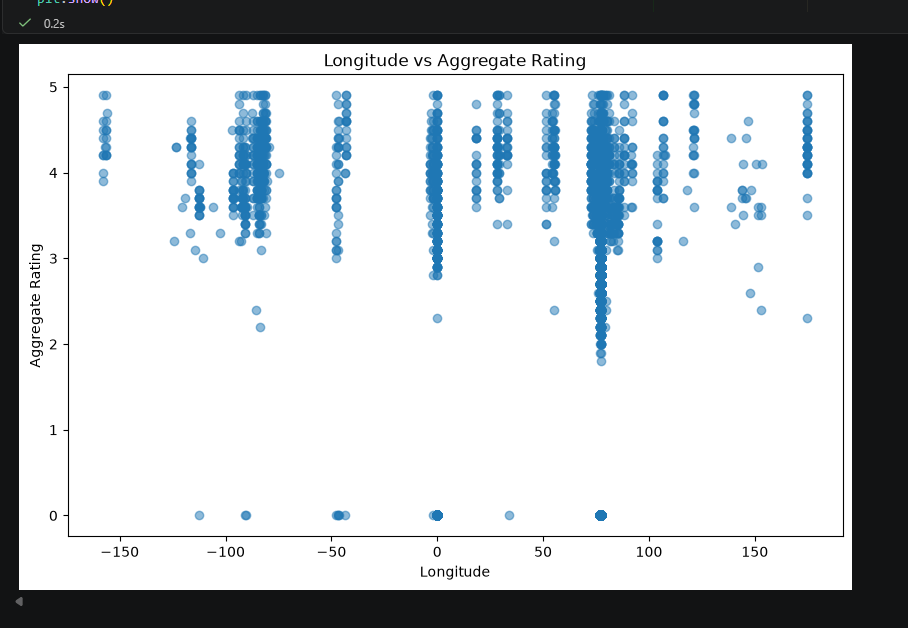
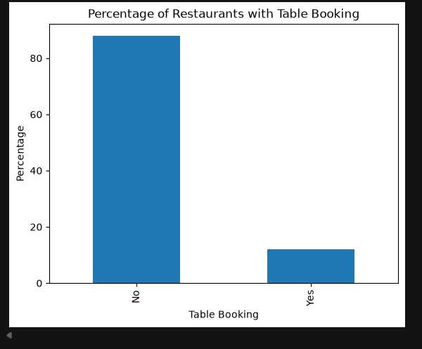
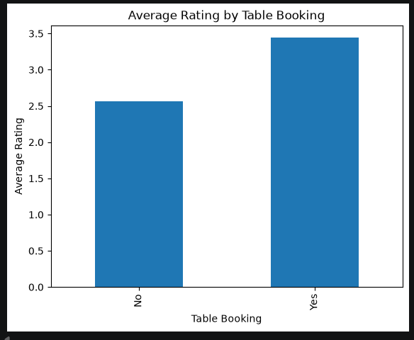
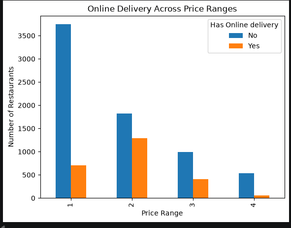
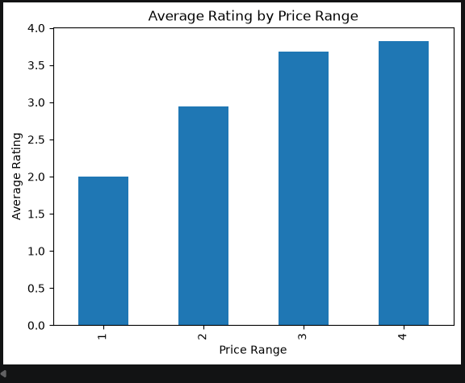

# 🍽️ Cognifyz Data Science Internship

## 📌 Project Overview

This repository contains the tasks completed as part of the **Cognifyz Data Science Internship Program**.

The project focuses on performing **Exploratory Data Analysis (EDA)**, **Descriptive Analysis**, **Geospatial Analysis**, **Restaurant Insights**, and **Feature Engineering** using Python.

---

# 🎯 Objectives

- Explore and understand the restaurant dataset.
- Perform descriptive statistical analysis.
- Analyze restaurant locations geographically.
- Study restaurant services such as table booking and online delivery.
- Analyze price ranges and customer ratings.
- Perform feature engineering for machine learning readiness.

---

# 🛠️ Technologies Used

- Python
- Pandas
- NumPy
- Matplotlib
- Jupyter Notebook
- VS Code
- Git & GitHub

---

# 📂 Project Structure

```
Cognifyz_DataScience_Internship/
│
├── Dataset/
│   └── Dataset.csv
│
├── Images/
│
├── Level_1/
│   └── Level_1_Task_Data_Exploration.ipynb
│
├── Level_2/
│   └── Level_2_Task_Data_Exploration.ipynb
│
├── README.md
├── requirements.txt
└── .gitignore
```

---

# 📊 Level 1 Tasks

## ✅ Task 1 — Data Exploration

- Loaded the dataset
- Checked missing values
- Explored data types
- Generated summary statistics
- Identified duplicate values

---

## ✅ Task 2 — Descriptive Analysis

- Statistical analysis of numerical columns
- Country distribution
- City distribution
- Cuisine distribution
- Restaurant distribution analysis

---

## ✅ Task 3 — Geospatial Analysis

- Restaurant location visualization
- Country-wise restaurant distribution
- City-wise restaurant distribution
- Relationship between location and ratings

---

# 📈 Level 2 Tasks

## ✅ Task 1 — Table Booking & Online Delivery

- Percentage of restaurants offering table booking
- Percentage of restaurants offering online delivery
- Comparison of average ratings
- Online delivery availability across price ranges

---

## ✅ Task 2 — Price Range Analysis

- Most common price range
- Average ratings by price range
- Rating color analysis
- Price range visualization

---

## ✅ Task 3 — Feature Engineering

- Created Restaurant Name Length feature
- Created Address Length feature
- Encoded Table Booking column
- Encoded Online Delivery column

---

## 📷 Project Screenshots

### Restaurant Locations


### Geospatial Analysis


### Rating vs Location Analysis


### Table Booking Percentage


### Average Rating by Table Booking


### Online Delivery Across Price Range


### Average Rating by Price Range


### Feature Engineering


---

# ▶️ How to Run

1. Clone the repository

```bash
git clone https://github.com/yourusername/Cognifyz_DataScience_Internship.git
```

2. Install dependencies

```bash
pip install -r requirements.txt
```

3. Open Jupyter Notebook

```bash
jupyter notebook
```

4. Run all notebook cells.

---

# 📚 Skills Demonstrated

- Exploratory Data Analysis (EDA)
- Data Cleaning
- Data Visualization
- Descriptive Statistics
- Feature Engineering
- Geospatial Analysis
- Data Preprocessing
- Git & GitHub

---

# 📌 Internship

Completed as part of the **Cognifyz Data Science Internship Program**.

---

# 👨‍💻 Author

**Alquama Arsalan Khan**

GitHub: https://github.com/Alquamaa20
